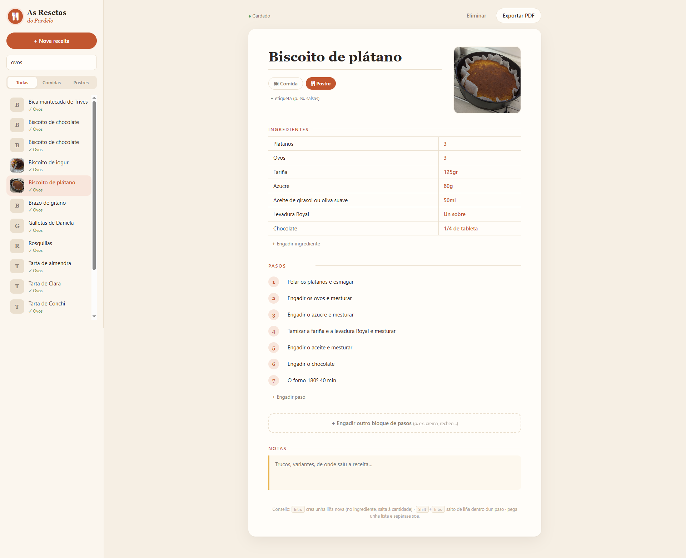
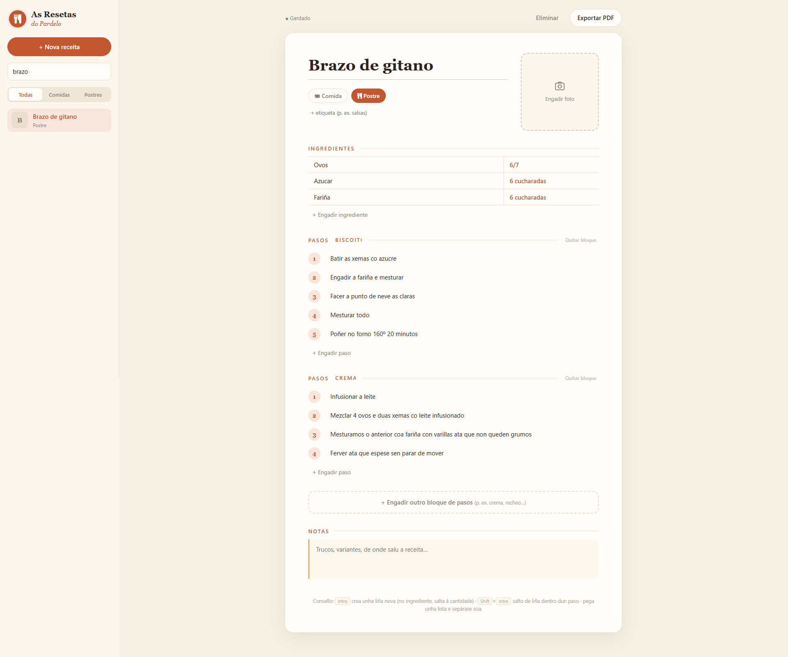
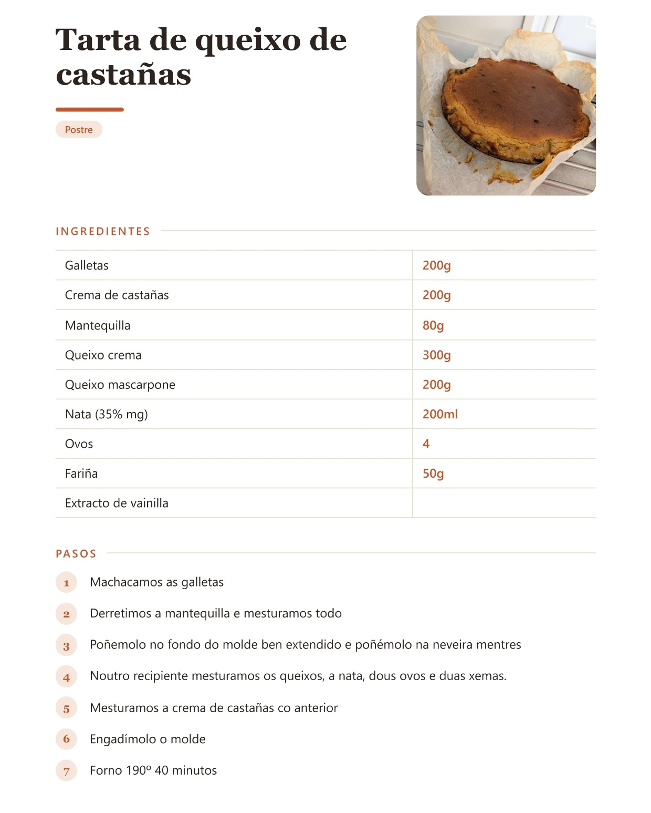

<div align="center">


<br>

**As receitas da casa, gardadas por ti e listas para imprimir**

Escribe os ingredientes, os pasos e as notas de cada receita, engádelle unha foto e
expórtaa a un PDF nun clic.

<br>


</div>

<br>

<div align="center">
<table>
<tr>
<td align="center"><br><sub><b>Inicio</b> — lista, filtros e busca por ingredientes</sub></td>
<td align="center"><br><sub><b>Editor</b> — bloques de pasos (biscoito, crema…)</sub></td>
<td align="center"><br><sub><b>PDF</b> — a receita lista para imprimir</sub></td>
</tr>
</table>
</div>

## Por que

Precisaba de unha maneira autoxestionada de gardar as receitas de familia. Normalmente as receitas acaban espalladas en cadernos, capturas de pantalla, mensaxes ou vídeos que un día desaparecen. As apps de receitas que existen queren que te rexistres, gardan todo
nos seus servidores e énchense de anuncios. 'As Resetas do Pardelo' é o contrario.

## Funcionalidades

- 🥣 **Crear receitas** — título, foto, ingredientes (nome e cantidade), pasos e notas nunha soa folla.
- 💾 **Gardado automático** — cada cambio gárdase ao momento en `Receitas/nome-da-receita.xml`. Se cambias o título, o ficheiro renoméase só. Sen botón de gardar (aínda que <kbd>Ctrl</kbd>+<kbd>S</kbd> tamén funciona)
- 🍽️ **Comidas e postres** — clasifica cada receita e filtra a lista cun clic
- 🏷️ **Etiquetas libres** — *salsas*, *sen forno*, *chocolate*… con suxestións das que xa usaches para non ter "salsa" e "salsas" á vez. Preme unha etiqueta na lista para ver só esas receitas
- 🗒️ **Notas** — trucos, variantes ou de onde saíu a receita, nun apartado propio ao final
- 🔎 **Busca por ingredientes** — escribe "ovos" e saen todas as receitas que os levan, co ingrediente atopado debaixo do nome. Sen importar tiles ("farina" atopa "fariña"), e con varias palabras ("ovos fariña") teñen que estar todas
- 📄 **Exportar a PDF** — título e foto arriba, categoría e etiquetas, ingredientes (en táboa, a dúas columnas se son moitos), cada bloque de pasos e as notas. Usa o diálogo de impresión do navegador → *Gardar como PDF*, co nome da receita xa posto
- 🤖 **App de Android** — a mesma interface no móbil, coas mesmas receitas
- ☁️ **Sincronización** — ao abrir a app de escritorio (e despois de cada cambio) a carpeta `Receitas` sincronízase con Firebase: o novo do escritorio sóbese e o novo do móbil baixa a XML, listo para o repositorio. Unha nubiña discreta na barra lateral indica o estado (preméndoa, sincroniza agora)

## Configuración

### Requisitos

| Requisito | Detalle |
|---|---|
| **Python 3.9+** | Biblioteca estándar e [pywebview](https://pywebview.flowrl.com/) para a xanela (instálase só a primeira vez) |
| **Windows 10/11** | pywebview usa o motor de Edge (WebView2), que xa vén co sistema |
| **Android Studio** | Só para compilar e instalar a app no móbil |
| **Un proxecto de Firebase** | Só para a app de Android (plan gratuíto) |

### ▶️ Arrancar a app

En Windows, dobre clic en **`As Resetas do Pardelo.pyw`**. A app ábrese na súa propia xanela.
A primeira vez instala pywebview (uns segundos). Se falla, desde unha terminal:

```bash
py -m pip install pywebview
```

Para desenvolver, tamén se pode abrir no navegador:

```bash
python server.py              # xanela propia (igual que o .pyw, pero con consola)
python server.py --navegador  # no navegador, en http://127.0.0.1:8765
```

A app só escoita en `127.0.0.1`, así que non é accesible desde outros equipos da rede.

### 🔥 Firebase (para a app de Android)

1. En [console.firebase.google.com](https://console.firebase.google.com) crea un proxecto (sen Analytics).
2. **Firestore Database** → *Crear base de datos* (modo produción, localización `eur3`).
3. Na lapela **Regras**, pega o contido de [`web/config/firestore.rules`](web/config/firestore.rules) e preme *Publicar*.
4. **Configuración do proxecto** (⚙) → *As túas apps* → engade unha app **web** (</>). Copia `apiKey` e `projectId`.
5. Copia `web/config/firebase.exemplo.json` como `web/config/firebase.json` e pon eses dous valores.

`firebase.json` non se sube ao repositorio. Sen login, calquera que teña a configuración pode
escribir na colección `receitas`; as regras só deixan gardar documentos con forma de receita.

### 🤖 App de Android

1. Fai antes o paso de Firebase (a app le `web/config/firebase.json`).
2. En Android Studio: *File → Open* → a carpeta **`android/`** do proxecto.
3. Activa a *depuración USB* no móbil, conéctao e preme **▶ Run**.

A app usa directamente a carpeta `web/`, así que calquera cambio na interface vale para os dous.
O móbil le e garda en Firebase; o escritorio sincroniza a carpeta `Receitas/` coa nube ao abrirse,
ao volver á xanela e despois de cada cambio:

- O creado ou editado nun sitio aparece no outro. Se se editou nos dous, queda a do escritorio.
- Borrar no escritorio bórraa da nube; borrar no móbil elimina o XML na seguinte sincronización.
- Se a nube se baleira (p. ex. proxecto de Firebase novo), as receitas do escritorio vólvense subir: nunca se borra un XML por iso.

### 📄 Formato das receitas

Cada receita é un ficheiro en `Receitas/`. Pódese editar á man, copiar a outro ordenador ou
metelo nun repositorio:

```xml
<?xml version='1.0' encoding='utf-8'?>
<receita creada="2026-09-27T13:21:55" modificada="2026-09-27T14:05:10">
  <titulo>Brazo de gitano</titulo>
  <categoria>postre</categoria>
  <etiquetas>
    <etiqueta>biscoitos</etiqueta>
  </etiquetas>
  <foto tipo="image/jpeg">/9j/4AAQSkZJRg…</foto>
  <ingredientes>
    <ingrediente cantidade="6/7">Ovos</ingrediente>
    <ingrediente cantidade="6 cucharadas">Azucre</ingrediente>
  </ingredientes>
  <pasos nome="biscoito">
    <paso>Batir as xemas co azucre</paso>
  </pasos>
  <pasos nome="crema">
    <paso>Infusionar o leite</paso>
  </pasos>
  <notas>Enrolar o biscoito aínda quente.</notas>
</receita>
```

## Estrutura xeral

```
as-resetas-do-pardelo/
├── As Resetas do Pardelo.pyw   # Lanzador: abre a app na súa xanela (sen consola)
├── server.py                   # Servidor local (stdlib) — serve a web e le/escribe os XML
├── nube.py                     # Descarga de Firebase a XML e borrado da nube
│
├── web/                        # Interface — HTML, CSS e JS sen frameworks nin compilación
│   ├── index.html              # Estrutura da app e da folla do PDF
│   ├── app.js                  # Editor, gardado automático, filtros, busca e exportación
│   ├── js/nube.js              # Almacenamento en Firebase (só na app de Android)
│   ├── config/                 # firebase.json (non se sube), o exemplo e firestore.rules
│   └── style/
│       ├── css/style.css       # Estilos da app e @media print para o PDF
│       ├── css/font-awesome*   # Iconas (Font Awesome 4.7)
│       └── fonts/              # Fontes de Font Awesome
│
├── android/                    # Proxecto de Android Studio (WebView que carga web/)
├── Receitas/                   # Unha receita por ficheiro .xml (os teus datos)
└── assets/                     # Banner e capturas de pantalla do README
```

## Evolución por versión

### v1.3.0
- **Xanela propia** con pywebview: sen navegador nin consola. Lanzador `As Resetas do Pardelo.pyw`.
- **App de Android** (`android/`), que reutiliza a carpeta `web/`. Fotos desde a galería e PDF co diálogo de impresión de Android.
- No móbil, dúas pantallas: ábrese na **lista de receitas** e cada receita ábrese ao tocala. Menú arriba á dereita (*Nova receita*, *Lista de receitas*); o botón atrás volve á lista.
- No móbil as receitas ábrense **só para ler**; o lapis (ao lado da papeleira) activa a edición.
- *Eliminar* pasa a ser unha icona de papeleira e pide confirmación nunha xanela propia.
- **Sincronización con Firebase** nos dous sentidos: ao abrir o escritorio súbese a carpeta `Receitas` e baixa o creado no móbil.
- Nubiña discreta na barra lateral co estado da sincronización.

### v1.2.0
- **Ingredientes en táboa**: o nome nunha celda e a cantidade noutra, no editor e no PDF.
- As receitas antigas sepáranse soas ("130g de fariña" → *Fariña* · *130g*).
- <kbd>Intro</kbd> no nome salta á cantidade, e ao pegar unha lista tamén se separan as cantidades.
- No PDF, os ingredientes van a dúas columnas cando son moitos.

### v1.1.0
- Iconas de **Font Awesome**, incluídas no propio proxecto (funciona sen internet).

### v1.0.0
- Primeira versión estable.
- Logotipo propio (garfo e coitelo) e icona na pestana.
- README co banner do proxecto.

### v0.10.0
- **Busca por ingredientes**, sen importar tiles e con varias palabras á vez; o ingrediente atopado amósase na lista.

### v0.9.0
- Apartado de **notas** na receita e no PDF.

### v0.8.0
- **Etiquetas** libres con suxestións das que xa usaches e filtro por etiqueta.
- A busca tamén mira nas etiquetas.

### v0.7.0
- **Categorías** (comida / postre) con filtro na lista lateral.
- A categoría aparece debaixo do nome na lista e no PDF.

### v0.6.1
- Deseño adaptado a pantallas pequenas.

### v0.6.0
- **Bloques de pasos** con nome propio (*Pasos biscoito*, *Pasos crema*…), compatibles coas receitas anteriores.

### v0.5.0
- **Busca por nome** na lista lateral.
- Atallo <kbd>Ctrl</kbd>+<kbd>S</kbd> para gardar ao momento.

### v0.4.1
- O navegador xa non garda versións vellas da app entre actualizacións.

### v0.4.0
- **Exportación a PDF** co deseño de folla de receita (título e foto arriba, ingredientes e pasos numerados).
- Atallo <kbd>Ctrl</kbd>+<kbd>P</kbd> para exportar.

### v0.3.0
- **Foto da receita**: clic ou arrastrar, reducida a 1200 px e gardada dentro do propio XML.
- Miniaturas das fotos na lista lateral.

### v0.2.0
- Interface web: **editor visual** de título, ingredientes e pasos, con atallos de teclado e pegado de listas.
- **Gardado automático** mentres escribes; se cambia o título, o ficheiro renoméase só.
- Lista lateral coas receitas gardadas.

### v0.1.0
- Servidor local en Python, sen dependencias, que garda cada receita nun ficheiro XML dentro de `Receitas/`.
- API sinxela para listar, ler, gardar e eliminar receitas.

## Folla de ruta

- [ ] Escalar as cantidades segundo o número de racións
- [ ] Exportar varias receitas xuntas nun libro en PDF
- [ ] Temporizadores nos pasos ("20 minutos no forno")

## Autor

[Ismael Castiñeira](https://ipardelo.es)

```bash
VIVA GHALISIA E A COSTA DA MORTE! 💀
```
